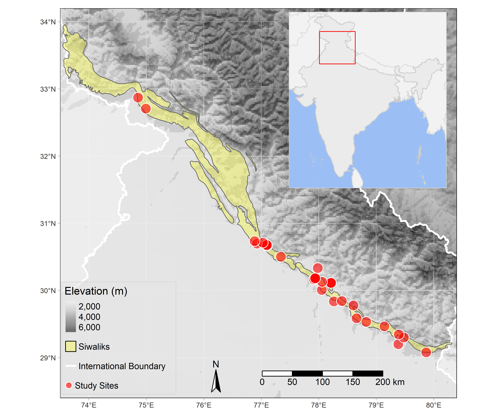

# Plant Ecology in Indian Siwaliks

```{r message=FALSE, warning=FALSE, echo=FALSE}
## set global options for markdown
knitr::opts_chunk$set(comment = "#>", collapse = TRUE, fig.align = 'center',
			    fig.width = 7, fig.height = 5, out.width = '80%', 
			    echo=FALSE, message=FALSE, warning=FALSE)
## load the required packages
library(bibliometrix) # for bibliometric analysis
library(dplyr) # general data manipulation and operations
library(ggplot2) # data visualisation
library(ggforce) # parallel plot
library(knitr) # for document tables
library(raster) # for raster data operations
library(revtools) # review tools functions for bibliography and article screening
library(sf) # spatial data operations
library(tmap) # spatial data visualisation and mapping

cbf_1 <- c("#999999", "#E69F00", "#56B4E9", "#009E73", 
           "#F0E442", "#0072B2", "#D55E00", "#CC79A7") # colour palette

## citations for the used packages
#knitr::write_bib(c(.packages(), "bookdown"), "packages.bib") 
```

## Abstract

Conservation science and practice commonly draw on the theories and methods of
social psychology to explain human cognition, emotion, and behaviour germane to
biodiversity conservation. We created a systematic map of the cross-disciplinary
conservation science literature, which draws on social psychology concepts and
methods in their application broadly described as conservation psychology.
Established protocols were used to systematically collect and collate
peer-reviewed research published in an explicit selection of multidisciplinary
conservation journals. We sought to catalogue the literature, elucidate trends
and gaps, and critically reflect on the state of conservation psychology and its
research practices that aim to influence conservation outcomes. The volume of
publications per year and per decade increased from 1974 to 2016. Although a
diversity of research designs and methods was applied, studies
disproportionately focused on specific concepts (attitudes and beliefs),
locations (North America and Europe), and contexts (terrestrial, rural). Studies
also tended to be descriptive, quantitative, and a theoretical in nature. Our
findings demonstrate that although conservation psychology has generally become
more visible and prominent, it has done so within a limited space and suggest
that disciplinary research principles and reporting standards must be more
universally adopted by traditional and multidisciplinary conservation journals
to raise the floor of empirical research.

## Introduction

The rate of anthropogenic biodiversity loss far exceeds the background rate of
species extinctions. Global targets for biodiversity acknowledge this,
nevertheless progress towards targets has been poor. There is now a reasonable
understanding of what human pressures threaten the survival of species. However,
information on where these threats are impacting species is needed to coordinate
conservation actions and threat abatement efforts. Herein, threats are defined
as human-driven pressures specifically where they co-occur with, and threaten
the survival of, native wild species. There is a large number of studies that
map either distributions of threatened species or human-driven pressures alone.
This makes it difficult to identify research that has investigated the spatial
distribution of the threats themselves. Additionally, the high variability in
approaches taken in these studies promotes a high risk of duplication and
diversity among the findings. This variation, and the lack of studies directly
mapping threats, limits the utility of threat mapping studies for conservation
planning and informing policy. Therefore, a systematic consolidation of the
literature is necessary to identify where knowledge is lacking, and where
sufficient evidence exists for synthesis of the collective findings.
Understanding ecological structure and functions is vital for ensuring the
sustainability of any ecosystem. Objective of the review Ecological studies
Concern/Problem Ecology enriches our world and is crucial for human wellbeing
and prosperity. It provides new knowledge of the interdependence between people
and nature that is vital for food production, maintaining clean air and water,
and sustaining biodiversity in a changing climate. There is a need to know the
quantity and quality of research that has been conducted on a specific question.
A descriptive overview is required of the evidence base for a given topic

Systematic mapping provides a snapshot of the current state of knowledge,
identifying areas needing more research attention and those ready for full
synthesis.

## Objectives

This review aims to describe the focus of plant ecological studies by analysing
the current evidence of existing studies. Further, we will identify the clusters
and gaps in the current knowledge, which will guide the future investigations.

-   **Primary question:** What evidence exists for research focusing on plant
    ecology in Indian Siwaliks?

    -   **Population:** The evidence base of studies focusing plant ecology in
        Indian Siwaliks. The taxonomic scope of this review is any plant species
        in the Siwaliks of north-west India. The siwalik region has been defined
        as the foothills of the Himalayas and spatially as defined by the
        Geological Survey of India
        (<https://bhukosh.gsi.gov.in/Bhukosh/MapViewer.aspx>).
    -   **Outcome:** The distribution of studies focusing plant ecology will be
        the outcome to be analysed. The studies to be included must have
        addressed any aspect of plant ecology. By Plant Ecology, we mean studies
        addressing distribution of plants, and interactions of plants with
        environment or other species. Thus, the studies must have plants as one
        of the components under study. However, this study will not focus on
        agroecological aspects, therefore studies focusing on agricultural
        systems will be beyond the scope of this review.

-   **Secondary questions**

    -   What is the geographical distribution of the evidence?
    -   What is the temporal distribution of the evidence?
    -   Which domains of ecology are frequently studied?
    -   What taxonomic groups of plants have been studied?\
    -   What are the knowledge gaps that need to be addressed?

## Methodology

We adopted the guidelines and recommendations established by Collaboration for
Environmental Evidence (CEE) for evidence synthesis in environmental management
[@CEE2018]. These recommendations are designed to improve transparency and
reproducibility of reviews in environmental contexts [@CEE2018; @grames2020]. We
departed from recommended practises as we neither consulted stakeholders nor
registered a protocol. A review team comprising of individuals with relevant
skills and knowledge (subject and methodological) was formed. The roles and
responsibilities of each participant has been defined during the initial project
development. We organised meetings and discussions at every weekend to develop
the protocol, search strategy, screening, data extraction, analyses and writing.
The selection of appropriate studies for the present review involved of three
phases: searching, screening, and inclusion (Figure \@ref(fig:fig21)).

```{r fig21, fig.cap="Schematic flow diagram for literature search, screening and inclusion process [modified from @haddaway2018]"}
library(DiagrammeR)
grViz("digraph G{
			
	graph[ranksep=0.35, newrank=true, nodesep=0.25, splines=ortho]
			
	subgraph cluster_searching{
	label=''; style=filled; color=mintcream; fontsize=18
	node[label='Scopus\n(n = 1,876)', shape=box, width=1.25, 
	fillcolor=grey95]searching_A;
	node[label='Web of Science\n(n = 1,013)', shape=box, width=1.25]searching_B;
	node[label='Total records\n(n = 2,888)', shape=box, width=3]searching_C;
	searching_A -> searching_C
	searching_B -> searching_C
	{rank=same;searching_A;searching_B}
	}
	
	subgraph cluster_screening{
	label=''; style=filled; color=lightyellow; shape=box; fontsize=18
	node[label='Records after duplicates removed \n (n = 2,171)', shape=box, 
	width=3]screening_1
	node[label='Records after title screening \n (n = 375)', shape=box, 
	width=3]screening_2
	node[label='Records after abstract screening \n (n = 111)',shape=box, 
	width=3]screening_3
	node[label='Articles retrieved at full text \n (n = 100)',shape=box, 
	width=3]screening_4
	node[label='Articles after full text screening \n (n = 40)',shape=box, 
	width=3]screening_5
	searching_C -> screening_1[minlen=1, label='    Screening']
	screening_1 -> screening_2 -> screening_3 -> screening_4 -> screening_5
	}
	
	node[label='Duplicates \n (n = 717)', shape=box, width=2, style=filled,
	fillcolor=seashell]screening_a
	node[label='Excluded titles \n (n = 1,796)', shape=box, width=2, style=filled,
	fillcolor=seashell]screening_b
	node[label='Excluded abstracts \n (n = 264)', shape=box, width=2, style=filled,
	fillcolor=seashell]screening_c
	node[label='Unretrievable full text \n (n = 11)', shape=box, width=2, style=filled,
	fillcolor=seashell]screening_d
	node[label='Excluded articles \n (n = 71)', shape=box, width=2, style=filled,
	fillcolor=seashell]screening_e
	
	screening_1 -> screening_a
	screening_2 -> screening_b
	screening_3 -> screening_c
	screening_4 -> screening_d
	screening_5 -> screening_e
	
	{rank=same;screening_1;screening_a;}
	{rank=same;screening_2;screening_b;}
	{rank=same;screening_3;screening_c;}
	{rank=same;screening_4;screening_d;}
	{rank=same;screening_5;screening_e;}
	
	subgraph cluster_articles{
	label=''; style=filled; color=grey95;
	node[label='Studies after full text screening \n (n = 40)', shape=box, width=3, 
	style=filled, fillcolor=grey95]articles_A
	node[label='Studies included in synthesis \n (n = 39)', shape=box, width=3, 
	style=filled, fillcolor=grey40, color=grey20, fontcolor=white]articles_B
	screening_5 -> articles_A[minlen=1, label='    Synthesis']
	articles_A -> articles_B
	}
	
	node[label='Excluded studies \n (n = 1)', shape=box, width=2, style=filled,
	fillcolor=seashell]studies_e
	articles_A -> studies_e
	{rank=same;articles_A;studies_e}	
	
	}",
	height = 800, width = 750)
```

### Literature database

Scopus (<https://scopus.com/>) and Web of Science
(<https://webofknowledge.com/>) are the most reliable databases for retrieval of
high-quality peer-reviewed scientific literature in the fields of science and
technology. Although the Web of Science Core Collection consists of seven
indices: (i) Science Citation Index Expanded (SCIE), (ii) Social Sciences
Citation Index (SSCI), (iii) Arts & Humanities Citation Index (AHCI), (iv)
Conference Proceedings Citation Index (CPCI), (v) Book Citation Index (BCI),
(vi) Emerging Sources Citation Index (ESCI), and (vii) Current Chemical
Reactions and Index Chemicus
(<https://clarivate.com/webofsciencegroup/solutions/web-of-science-core-collection/>),
our institution provided us access to SCIE, SSCI and AHCI for the timespan
1989-present. Both databases allow to export bibliographic meta-data offer great
accuracy and reproducibility of literature search. However, access to these
databases required a subscription through payment of large money. Although both
databases emerged in 2004, Scopus offers relatively larger coverage of
scientific literature whereas Web of Science provides offers coverage from early
1900.

On the other hand, Google Scholar (<https://scholar.google.com/>) is freely
available and has most comprehensive coverage as it offers retrieval of most
obscure information. Although it also provides access to full text articles, it
is not a bibliographic database. Its content is dynamic and has compromised
accuracy. Further, it lacks several functionalities in literature search like
subject filtering and tagging. Considering these limitations, we limited our
literature search to two bibliographic databases of peer-reviewed literature
([Web of Science Core Collection](https://webofknowledge.com/) and
[Scopus](https://scopus.com/)).

### Search strings

We identified the terms that are frequently applied to the region using a
preliminary literature search and discussion with review team members 
(Table \@ref(tab:kw21)). 

```{r kw21}
kw <- data.frame(group1 = c("shivalik", "sivalik", "shiwalik", "siwalik"), 
	  group2 = c("himalayan foothills", "outer himalayas", "sub himalayas", ""), 
	  group3 = c("jammu hills", "kangra hills", "morni hills", "mohand hills"), 
	  group4 = c("dudhwa range", "dundwa range", "", ""))

knitr::kable(kw, caption = "List of keywords used for developing search string") %>%
	kableExtra::row_spec(0, background = "#666", color = "#fff")
```

Using a combination of these terms with boolean operators, 
we developed the following common search string for 
[Web of Science](https://webofknowledge.com/) and [Scopus](https://scopus.com/).

> (shivalik OR sivalik OR shiwalik OR siwalik) OR (himalaya\* AND (foothill\* OR
> outer OR sub)) OR (hill\* AND (jammu OR kangra OR morni OR mohand)) OR
> (range\* AND (dudhwa OR dundwa))

### Literature search

[Scopus](https://scopus.com/): We have queried the above defined search
    string to the "Article title, Abstract, Keywords" in "Documents" using the
    default options for "Limit" (Date range (inclusive): Published from "All
    years" to "Present"; Document type: "ALL"). This query returned a total of
    4,102 document results on 03 April 2021. Then, we have filtered the results
    by limiting subject to "Agricultural and Biological Sciences" and
    "Environmental Science" subject areas, which yielded a total of 1,875
    documents. All these documents were selected by choosing "Select All" option
    and then exported all information by selecting "Citation information",
    "Bibliographical information", "Abstract & keywords", "Funding details" and
    "Other information" in the BibTex format.

[Web of Science Core Collection](https://webofknowledge.com/): The same
    keyword combination was queried in the "Topic" field of Web of Science by
    selecting the database "Web of Science Core Collection". Default settings
    (Web of Science Core Collection: Citation Indexes - Science Citation Index
    Expanded (SCI-EXPANDED) --1989-present, Social Sciences Citation Index
    (SSCI) --1989-present, and Arts & Humanities Citation Index (A&HCI)
    --1989-present; Auto-suggest publication names: On; and Default Number of
    Search Fields to Display: 1 field (Topic)) were used under the more settings
    option. This yielded us 2,978 results on 03 April 2021. Then the results
    were refined by selecting following Web of Science categories: ENVIRONMENTAL
    SCIENCES, PLANT SCIENCES, PALEONTOLOGY, ECOLOGY, BIOLOGY, REMOTE SENSING,
    SOIL SCIENCE, BIODIVERSITY CONSERVATION, FORESTRY, EVOLUTIONARY BIOLOGY, and
    ENVIRONMENTAL STUDIES. This yielded a total of 1,013 results. Then the
    "Show" option was changed from "10 per page" (Default) to "50 per page".
    Next, all entries on a page were first selected using the "Select Page"
    option and then added to "Marked List" using the "Add to Marked List"
    button. This was repeated for all the 21 pages and thus all the 1,103
    entries were added to the "Marked List". Since Web of Science allows export
    of 500 records at time, we have first selected the first 500 records by
    defining the record range "Records: 1 to 500" under the "Step 1: Select
    records." option. Then we have selected all the fields using the "Select
    All" option under "Step 2: Select content. Select from the fields below:"
    option. Next, we have exported the records in BibTex format using the
    "Export" option under the "Step 3: Select destination." And then choosing
    the "BibTex" option under the "Other File Formats". The same process was
    repeated for records 501 to 1,000 and 1,001 to 1,013.

### Article screening

We used the package *revtools* [@revtools2019] in R programming environment [@R-base]
for article screening phase. This phase included de-duplication, title screening,
abstract screening and full text screening. For article screening phase, we adhered 
to the previously proposed eligibility criteria (Table \@ref(tab:ec22)).

```{r ec22}
ec <- data.frame(
	c("articles falling in general scope of plant ecology",
	  "study sites or their part situated within the boundary of Siwaliks",
	  "studies involving plants as one of the component",
	  "studies related to plant distributions and their interactions with 
	  environment", 
	  "studies involving ecosystem processes such as nutrient cycling, carbon 
	  sequestration, and biomass production", 
	  "studies referring to palaeoecological studies such as fossil distribution 
	  and past vegetation",
	  "studies concerning animals, fungi, microbes or any organism other than 
	  plants", 
	  "studies focusing agroecosystems and agricultural practices", 
	  "studies related to ethnobotanical or traditional uses of plants", 
	  "studies evaluating phytochemicals or biological activities",
	  "studies focusing cytology, genetics or molecular biology of plants",
	  "studies reporting discovery of new species")
	)

knitr::kable(ec, col.names = "Criteria",
		 caption = "Eligibility criteria for inclusion or exclusion of studies") %>%
	kableExtra::row_spec(0, background = "#666", color = "#fff") %>%
	kableExtra::pack_rows("Inclusion", 1, 6) %>%
	kableExtra::pack_rows("Exclusion", 7, 12)
```


```{r eval=FALSE}
## read all the bibliography
data_all <- read_bibliography(c("./data/siwalik-ecology/scopus.bib", 
					  "./data/siwalik-ecology/wos1.bib", 
					  "./data/siwalik-ecology/wos2.bib", 
					  "./data/siwalik-ecology/wos3.bib"))

## identify and remove duplicates by doi
match.doi <- find_duplicates(data = data_all) # match by doi
unique_doi <- extract_unique_references(x = data_all, matches = match.doi)

## identify and remove duplicates by title
# exact title matching
match.title <- find_duplicates(data = unique_doi, match_variable = "title",
					 to_lower = TRUE, remove_punctuation = TRUE)
unique_title <- extract_unique_references(x = unique_doi, matches = match.title)

## write and save unique references
#write_bibliography(x = unique_title, filename = "./data/siwalik-ecology/unique_refs.ris", 
			 #format = "ris")
## remove variables from the environment
rm(list = ls()) 
```

**De-duplication**: Database may have erroneous duplications or due to automated information
extraction systems. Thus, the documents can be largely duplicated within and
across literature databases. These duplicates might waste the energy and time of
the reviewers apart from erroneous results of reviews. Therefore, removal of
duplicates is necessary. Several procedures and software are available for
automated de-duplication of literature. Here, we have first de-duplicated the
documents based on doi (digital object identifier) of each articles. Then, we
have de-duplicated by matching title of each article. However, the upper- or
lower case and punctuations can interfere with title matching. Therefore, we
converted titles to lower case and removed punctuations before matching. Thus,
after de-duplication we are left with 2,171 (unique doi = 2,366, unique doi +
unique title = 2,171) articles out of total 2,888 articles (Figure \@ref(fig:fig21)). 
After this, we have performed manual screening of duplicates, if remained any.

```{r eval=FALSE}
## read the unique articles
unique_refs <- read_bibliography(filename = "./data/siwalik-ecology/unique_refs.ris")
## screen titles of unique articles
sc_titles <- screen_titles(unique_refs)
## write screened titles to local file
#write.csv(sc_titles, "./data/siwalik-ecology/screened_titles.csv")
## remove all variables from the environment
rm(list = ls()) 

# summary of title screening
read.csv("./data/siwalik-ecology/screened_titles.csv")$screened_titles %>% table() %>% 
	t() %>% kable(caption = "Summary of title screening")
```

**Title screening**: After de-duplication of articles, we performed 
article screening based on their titles. We have hidden every other information 
during title screening to avoid any potential bias. We assigned one of three labels 
to each article (i) *selected*, (ii) *excluded*, or (iii) *unknown*. We excluded 
1,796 articles based on title screen and remaining 375 articles were
selected for abstract screening out of which 158 articles were assigned
"selected" and 217 articles were assigned "unknown" during the title screening. 
Next, we removed the articles assigned as "excluded" and screened for abstracts.

```{r eval=FALSE}
## read screened titles and filter the included titles
included_title <- read.csv("./data/siwalik-ecology/screened_titles.csv") %>% 
      filter(screened_titles != "excluded")
## screen abstracts of included titles
sc_abstracts <- screen_abstracts(included_title)
## write screened abstracts
#write.csv(sc_abstracts, "./data/siwalik-ecology/screened_abstracts.csv")
## remove variables from the environment
rm(list = ls()) 

## summary of abstract screening
read.csv("./data/siwalik-ecology/screened_abstracts.csv")$screened_abstracts %>% 
      table() %>% t() %>% kable(caption = "Summary of abstract screening")

## read screened abstracts and filter the included abstracts
included_abstracts <- read.csv("./data/siwalik-ecology/screened_abstracts.csv") %>% 
      filter(screened_abstracts != "excluded")
## write included abstracts
#write.csv(x = included_abstracts, 
			 #file = "./data/siwalik-ecology/included_abstracts.csv")
```

**Abstract screening**: Our abstract screening resulted in exclusion of 264 articles and 
we are left with only 111 articles. Then we filtered these 111 articles and saved as the 
included articles (Figure \@ref(fig:fig21)). Then we searched for full text for 
every article from publisher's website,
Google Scholar, Research Gate and institutional repositories. We were not able
to retrieve full text of following 11 articles. We excluded these 11 articles and 
screened full text of articles.  

1.  Devi, B., Bhardwaj, D. R., Panwar, P., Pal, S., Gupta, N. K., & Thakur, C.
    L. (2013). Long term effects of natural and plantation forests on carbon
    sequestration and soil properties in mid-hill sub-humid condition of
    Himachal Pradesh, India. *Range Management and Agroforestry, 34*, 19--25.
2.  Mehta, S., & Singh, Y. (1994). Spatio-temporal changes in the natural hilly
    ecosystem: a case study of the Chandigarh Siwalik Hills. *Transactions -
    Institute of Indian Geographers, 16*, 135--146.
3.  Pandey, R. K., Bindroo, B. B., Dhar, A., & Khan, M. A. (2010). Oak
    regeneration in Sub-Himalayan India. *Indian Silk, 1*, 19--21.
4.  Panwar, P., Pal, S., Bhatt, V. K., & Prasad, R. (2014). Land use and canopy
    positions affect organic carbon pools and fertility of soils in lower
    Himalayan region, India. *Agrochimica, 58*, 51--62.
5.  Pokhriyal, T. C., Chaukiyal, S. P., & Singh, K. C. H. (1996). Nitrogen
    fixation and nodulation behaviour in relation to seasonal changes in six
    multipurpose tree species. *Indian Forester, 122*, 718--726.
6.  Purohit, S., Aggarwal, S. P., & Patel, N. R. (2021). Estimation of forest
    aboveground biomass using combination of Landsat 8 and Sentinel-1A data with
    random forest regression algorithm in Himalayan Foothills. *Tropical
    Ecology, 62*, 288--300. <https://doi.org/10.1007/s42965-021-00140-x>
7.  Rajwar, G. S. (1991). *Advances in Himalayan Ecology*. Today & Tomorrow's
    Printers and Publishers, New Delhi.
8.  Rajwar, G. S. (1993). *Garhwal Himalaya: Ecology and Environment*. Ashish
    Publishing House, New Delhi.
9.  Ram, N., & Jana, M. M. (1997). Ecological impact of compaction under teak
    plantation in the foothill of Darjeeling himalaya. *Indian Forester, 123*,
    623--630.
10. Rout, S., & Gupta, S. (1989). Soil respiration in relation to abiotic
    factors, forest floor litter, root biomass and litter quality in forest
    ecosystems of Siwaliks in Northern India. *Acta Oecologica. Oecologia
    Plantarum, 10*(3), 229--244.
11. Singh, R., Goraya, G. S., Singh, C., Kumar, S., & Kumar, S. (2001).
    Mortality of Chir pine trees by insect borers in Morni Hills, Haryana - A
    case study. *Indian Forester, 127*, 1279--1286.

```{r eval=FALSE}
## read the included abstracts and select the label, journal and year columns
included_abstracts <- read.csv("./data/siwalik-ecology/included_abstracts.csv") %>%
	dplyr::select(label, title, journal, year, doi)
## write included abstracts with selected column
#write.csv(x = included_abstracts, file = "./data/siwalik-ecology/screened_fulltext.csv")
## read the screened fulltext
screened_fulltext <- read.csv("./data/siwalik-ecology/screened_fulltext.csv")
## summary of fulltext screening
screened_fulltext$screened_fulltext %>% table() %>% t() %>% 
	kable(caption = "Summary of fulltext screening")
```

**Full text screening**: For full text screening, we first selected five variables 
(`label`, `title`, `journal`, `year`  and `doi`) from the included abstracts. 
Then, we manually  screened articles based on the full text of every article. 
This process excluded 71 more articles and we left with only 40 studies 
(Figure \@ref(fig:fig21)).

### Data extraction

Considering the questions initially posed, we looked for the following
information (if available) for each article:

-   taxonomic group of plants under study (if available), to estimate taxonomic scope of studies
-   geographic location (latitude and longitude) to estimate geographical
    distribution of studies. If it is not available in study, we estimate the
    approx location using Google Maps and Google Earth. We also recorded the
    Indian state in which study was conducted.
-   year of the study to estimate temporal distribution of studies
-   Domain of plant ecology for each the study. Adopting a single
    unique classification system for ecological studies is difficult as study
    areas often overlap. However, we adhered to the following broad classification
    system for the present study (Table \@ref(tab:clasf23)).

```{r clasf23}
clasf <- data.frame(
	ed = c("Organismal ecology", "Physiological ecology", "Population ecology", 
		 "Species interactions", "Community ecology", "Ecosystem ecology",
		 "Palaeoecology", "Landscape ecology", "Applied ecology"),
	
	sd = c("Population genetics, natural selection, behaviour",
		 "Adaptations to abiotic factors like temperature, light",
		"Population growth, demography, age structure",
		 "Competition, facilitation, parasitism, symbiosis",
		 "Species diversity, succession, biogeography",
		 "Food web, biomass production, nutrient cycling, soil",
		 "Fossil records, palaeo-vegetation",
		 "Land use and land cover, ecological modelling, spatial and global ecology",
		 "Conservation, management and restoration ecology")
	)

knitr::kable(clasf, col.names = c("Ecology domain", "Included topics"),
		 caption = "Classification scheme for included studies") %>%
	kableExtra::row_spec(0, background = "#666", color = "#fff")
```
Next, we manually extracted data from each of the 40 articles and assigned an
ecological domain according the above classification system (Table
\@ref(tab:clasf23)).

```{r}
## read the screened fulltext and filter the selected articles
included_articles <- read.csv("./data/siwalik-ecology/screened_fulltext.csv") %>%
	filter(screened_fulltext == "selected") %>% dplyr::select(-c(X, screened_fulltext))
## write the selected articles for data extraction
#write.csv(x = included_articles, "./data/siwalik-ecology/included_articles.csv")

## read the extracted data
extracted_data <- read.csv("./data/siwalik-ecology/extracted_data.csv")
```

### Bibliometric data

We developed a search string based on the doi (digital object identifier) and 
title (if doi is not available) of included studies to  extract bibliometric metadata from the 
Scopus database. We retrieved bibliometric information for 39 articles on 09 May 2021.
However, we were not able to extract metadata for an article because it was not available 
in Scopus; therefore, we excluded it from the final systematic map and narrative 
synthesis (Figure \@ref(fig:fig21)). This bibliometric data had several missing 
values (marked as `NA`), these values were manually added from the full text.

## Results

Our systematic literature search yielded total 2,888 documents from both Scopus 
and Web of Science Core Collection. After de-duplication and article screening, 
these records were reduced to 40 studies (Figure \@ref(fig:fig21)). However, only 
39 studies were included in the final synthesis as bibliographic metadata was not 
available for a study (Figure \@ref(fig:fig21)). Thus, this synthesis is based on 
total 39 studies published in 26 sources (journals) during 1988 to 2021. The results
of descriptive analysis of bibliometric indicators for selected studies is represented
in Table \@ref(tab:gendesc24).

```{r results=FALSE, include=FALSE}
library(bibliometrix)
M <- convert2df(file = "./data/siwalik-ecology/scopus_trimmed.bib", 
		    dbsource = "scopus", format = "bibtex")
results <- biblioAnalysis(M, sep = ";")
summary(results)
```

```{r gendesc24}
main_info <- read.csv("./data/siwalik-ecology/Main_Information.csv")
mi_trimmed <- main_info %>% dplyr::filter(!Results == "")

knitr::kable(mi_trimmed, 
		 caption = "General description of extracted bibliometric indicators from Scopus") %>%
	kableExtra::row_spec(0, background = "#666", color = "#fff") %>% 
	kableExtra::pack_rows("Main information about data", 1, 7) %>% 
	kableExtra::pack_rows("Document types", 8, 8) %>%
	kableExtra::pack_rows("Document contents", 9, 10) %>%
	kableExtra::pack_rows("Authors", 11, 14) %>%
	kableExtra::pack_rows("Authors collaboration", 15, 19)
```

The studies identified for the present review were published in 26 different 
journals. Further, only nine journals had represented more than one study 
identified in this article (Figure \@ref(fig:2-journals)). These nine journals
(about 34.6%) represented about 56.4% of the total studies (n = 22) included.

```{r 2-journals, fig.cap="Publication sources (journals) representing at least two studies identified in the present article. The number of publications in a particular journal is represented in parenthesis"}
set.seed(254)
library(ggwordcloud)
ex_data <- read.csv("./data/siwalik-ecology/extracted_data.csv") %>% 
	dplyr::select(journal) %>% 
	table() %>% 
	as.data.frame() %>% 
	filter(Freq > 1) %>%
	mutate(journal = paste0(., " (", Freq, ")"))

ggplot(ex_data, aes(label = journal, size = Freq, color = as.factor(Freq))) +
	geom_text_wordcloud() +
	#scale_size_area(max_size = 9) +
	scale_radius(range = c(2, 9), limits = c(0, NA)) +
	scale_color_manual(values = c("#abdda4", "#66c2a5", "#3288bd")) +
	theme_void()
```

Among the selected 39 studies, experimental studies were under-represented, 
accounting for just about 5% of total studies. On the other hand, observational 
and modelling studies were heavily dominated constituting about 95% of all the 
studies (Figure \@ref(fig:2-stype)).

```{r 2-stype, fig.cap="Breakdown of selected studies by study type (EXP = experimental, MOD = modelling, OBS = observational), region (CH = Chandigarh, HR = Haryana, HP = Himachal Pradesh, JK = Jammu and Kashmir, UK = Uttarakhand, WR = whole region) and domains of ecology (AE = applied ecology, CE = community ecology, EE = ecosystem ecology, LE = landscape ecology, PL = palaeoecology, PE = physiological ecology, SI = species interactions). The number of publications within each category is indicated in parenthesis", out.width="100%"}
library(ggforce)
library(dplyr)
library(ggplot2)

ex_data <- read.csv("./data/siwalik-ecology/extracted_data.csv")

## code the labels
study_lab <- table(ex_data$study_type) %>% as.data.frame() 
ex_data$study_type1 <- factor(ex_data$study_type, 
			     labels = c("experimental" = paste0("EXP", " (", study_lab[1,2], ")"), 
			     	     "modelling" = paste0("MOD", " (", study_lab[2,2], ")"),
			     	     "observational" = paste0("OBS", " (", study_lab[3,2], ")")))

loc_lab <- table(ex_data$location) %>% as.data.frame()
ex_data$location1 <- factor(ex_data$location, 
			     labels = c("Chandiagrh" = paste0("CH", " (", loc_lab[1,2], ")"), 
			     	     "Haryana" = paste0("HR", " (", loc_lab[2,2], ")"),
			     	     "Himachal Pradesh" = paste0("HP", " (", loc_lab[3,2], ")"),
			     	     "Jammu and Kashmir" = paste0("JK", " (", loc_lab[4,2], ")"),
			     	     "Uttarakhand" = paste0("UK", " (", loc_lab[5,2], ")"),
			     	     "Whole Region" = paste0("WR", " (", loc_lab[6,2], ")")
			     	     ))

dom_lab <- table(ex_data$domain) %>% as.data.frame()
ex_data$domain1 <- factor(ex_data$domain, 
			     labels = c("Applied Ecology" = paste0("AE", " (", dom_lab[1,2], ")"), 
			     	     "Community Ecology" = paste0("CE", " (", dom_lab[2,2], ")"),
			     	     "Ecosystem Ecology" = paste0("EE", " (", dom_lab[3,2], ")"),
			     	     "Landscape Ecology" = paste0("LE", " (", dom_lab[4,2], ")"), 
			     	     "Palaeoecology" = paste0("PL", " (", dom_lab[5,2], ")"),
			     	     "Physiological Ecology" = paste0("PE", " (", dom_lab[6,2], ")"),
			     	     "Species Interactions" = paste0("SI", " (", dom_lab[7,2], ")")
			     	     ))


ext_dat <- ex_data %>% dplyr::select(study_type1, location1, domain1) %>%
	ggforce::gather_set_data(1:3)


ext_dat$x <- factor(ext_dat$x, 
			  labels = c("study_type1" = "Study type", "location1" = "Region", "domain1" = "Domain"),
			  levels=c("study_type1", "location1", "domain1"))

ggplot(ext_dat, aes(x, id = id, split = y, value = 1))  +
	geom_parallel_sets(aes(fill = study_type1), alpha = 0.3, axis.width = 0.18, show.legend = FALSE) +
	geom_parallel_sets_axes(axis.width = 0.15, fill = "grey90") +
	geom_parallel_sets_labels(color = "black", angle = 0, size = 4) +
	scale_x_discrete(expand = c(0.06, 0)) +
	theme_classic() +
	theme(axis.title = element_blank(),
		axis.text.y = element_blank(),
		axis.ticks = element_blank(),
		axis.line = element_blank(),
		axis.text.x = element_text(size = 14))
```

### Temporal distribution of studies

The number of publications has shown an overall increasing trend and exhibited 
an annual growth rate of about 4.3% (Figure \@ref(fig:temp23)). During 2010s 
annual production of scientific publications observed a steep rise and the year 
2020 recorded highest number of publications (n = 6) within a single year 
(Figure \@ref(fig:temp23)). Further, the decadal frequency of publications also 
displayed an increasing trend. The decadal frequency of publications rose to six 
during 2000s, which was stagnating to only four during 1980s and 1990s. However, 
this frequency increased by more than 350% (n = 22) during 2010s 
(Figure \@ref(fig:temp23)). 

```{r temp23, fig.cap="Annual frequency of scientific publications included in this synthesis. The trend line is fitted using 80% LOESS (y ~ x) smoothening. Inset shows the decadal frequency of publications"}
library(dplyr)
library(ggplot2)

ex_data <- read.csv("./data/siwalik-ecology/extracted_data.csv")
temp_dat <- table(ex_data$year) %>% as.data.frame()
temp_dat$year <- temp_dat$Var1 %>% as.character() %>% as.numeric()

df <- temp_dat %>% mutate(decade = 
			  	ifelse(year<=1989, "'80s", 
			  		 ifelse(year>=1990 & year<=1999, "'90s", 
			  		 	 ifelse(year>=2000 & year<=2009, "'00s", 
			  		 	 	 ifelse(year>=2010 & year<=2019, "'10s", "'21")
			  		 	 	 )
			  		 	 )
			  		 )
				  )

df$decade <- factor(df$decade,
			  levels = c("'80s",  "'90s", "'00s", "'10s", "'21"))
df <- df %>% group_by(decade) %>% 
	summarise(total_articles = sum(Freq))

p1 <- ggplot(data = df, aes(x = total_articles, y = decade)) + 
	geom_bar(stat = "identity", width = 0.65, fill = "#69b3a2") +
	geom_text(aes(label = paste0("n=", total_articles)), color = "#69b3a2", size = 4, 
		    vjust = 0.5, hjust = -0.25) +
	geom_text(aes(label = decade, x = 0.5), color = "white", size = 4, hjust = 0.1) +
	xlim(0, 25) +
	theme_void() +
	theme(plot.background = element_rect(color = "#69b3a210"))

ggplot(data = temp_dat, aes(x = year, y = Freq)) + 
	#geom_area(fill = "grey95", alpha = 0.5) +
	geom_area(fill = "#69b3a2", alpha = 0.1) +
	geom_line(color = "#69b3a2", lwd = 1) +
	geom_point(size = 4, col = "#69b3a2") +
	geom_smooth(color = "red", se = FALSE, span = 0.8, lwd = 1.2) +
	labs(x = "Year of Publication", y = "Number of Publications") +
	theme_classic() +
	theme(axis.title = element_text(size = 14), 
		axis.text = element_text(size = 12),
		axis.line = element_line(size = unit(1, "cm")),
		axis.ticks.length = unit(1.5, "mm"),
		panel.grid.major.y = element_line(color = "grey80")
		) +
	annotation_custom(ggplotGrob(p1), xmin = 1988, xmax = 2007, 
                       ymin = 2.5, ymax = 6)
```

### Geographical distribution of the studies

```{r eval=FALSE}
## read the boundary of India
ind0 <- st_read("./data/siwalik-ecology/ind_adm0.gpkg")
## extract countries for Asia
asia <- rnaturalearth::ne_countries(scale = "medium", type = "countries",
						 continent = "Asia", returnclass = "sf")
## A bounding box for Indian subcontinent
indsub.bbox <- st_bbox(obj = c(xmin = 67, xmax = 98, ymin = 5, ymax = 38),
                    crs = st_crs(4326)) %>% st_as_sfc()
## clip the Indian subcontinent
indsub.clipped <- st_intersection(asia, indsub.bbox)
## bounding box for area of interest
sw_box <- st_bbox(obj = c(xmin = 73.5, xmax = 80.4, ymin = 28.4, ymax = 34.2),
                    crs = st_crs(4326)) %>% st_as_sfc()
## prepare inset map
inset_map <- tm_shape(indsub.clipped, bbox = ind0) + tm_fill(col = "grey95") + 
	tm_borders(col = "grey85") +
      tm_shape(ind0) + tm_fill(col = "grey92") + 
	tm_borders(col = "grey80") +
      tm_shape(sw_box) + tm_borders(col = "red", lwd = 1) +
      tm_layout(bg.color = "#9bbff4", frame = "grey85")

## read the required data for the main map
# shaded relief for the area
#indsr <- raster("D:/spatial-data/Themes/SR_LR/SR_LR/SR_LR.tif") %>% 
	#crop(extent(73.5, 80.4, 28.4, 34.2))
#writeRaster(indsr, "./data/siwalik-ecology/shaded-relief.tif")
indsr <- raster("./data/siwalik-ecology/shaded-relief.tif")
# elevation data for area
#indem <- raster("D:/spatial-data/dem/india-dem/gt30e060n40.tif") %>%
	#crop(extent(73.5, 80.4, 28.4, 34.2))
#writeRaster(indem, "./data/siwalik-ecology/dem.tif")
indem <- raster("./data/siwalik-ecology/dem.tif")
# India mask to highlight the region
ind_mask <- st_difference(sw_box, ind0)
# boundary of siwalik region
sw <- st_read("./data/siwalik-ecology/siwalik.shp")
# study points
ex_data <- read.csv("./data/siwalik-ecology/extracted_data.csv")
study_points <- ex_data %>% filter(!is.na(lat)) %>% 
	st_as_sf(coords = c("lon", "lat"), crs = 4326)
## prepare main map
main_map <- tm_shape(indsr, bbox = sw_box) + tm_raster(palette = "-Greys", 
									 legend.show = F) +
	tm_graticules(col = "grey80") + # graticule
	tm_shape(indem) + tm_raster(alpha = 0.6, palette = "Greys", style = "cont", 
					    title = "Elevation (m)") + 
	tm_shape(ind0) + tm_borders(lwd = 2.5, col = "white") +
	tm_shape(ind_mask) + tm_fill(col = "white", alpha = 0.3) +
	tm_shape(sw) + tm_fill(col = "yellow", alpha = 0.3) + tm_borders() +
	tm_shape(study_points) + tm_symbols(col = "red", border.col = "white", 
							alpha = 0.6) +
	tm_compass(position = c(0.35, 0.015)) + # North Arrow
      tm_scale_bar(position = c(0.5, 0.015), text.size = 0.75) + # scale
      tm_add_legend(type = "fill", labels = "Siwaliks", col = "yellow", 
      		  alpha = 0.3) + 
      tm_add_legend(type = "line", labels = "International Boundary", 
      		  col = "white", lwd = 2.5) + # road legend
      tm_add_legend(type = "symbol", labels = "Study Sites", col = "red", 
      		  border.col = "white",
      		  alpha = 0.6) +
      tm_layout(legend.position = c(0.0035, 0.01),
                legend.bg.color = "grey90", legend.bg.alpha = 0.5,
                legend.text.size = 0.75, legend.frame = "grey85")
## aspect ratios for inset map
in_bb <- st_bbox(ind0)
aspin <- (in_bb$ymax - in_bb$ymin)/(in_bb$xmax - in_bb$xmin)
## aspect ratios for main map
mn_bb <- st_bbox(indsr)
aspmain <- (mn_bb$ymax - mn_bb$ymin)/(mn_bb$xmax - mn_bb$xmin)
## create a viewport for inset map
vp <- grid::viewport(x = 0.92, y = 0.98, width = grid::unit(2.5, "inches"), 
               height = grid::unit(2.5*aspin, "inches"), 
		   just = c("right", "top"))
## save the map
tmap_save(main_map, filename = "./data/siwalik-ecology/map.png", insets_tm = inset_map, 
          insets_vp = vp, height = aspmain*7, width = 7, units = "in", dpi = 600)
rm(list = ls())
```

```{r map21, fig.cap="Geographic distribution of the study sites (reported or estimated from publications)"}
## include in the document

```

### Domains of ecology

```{r}
ex_data <- read.csv("./data/siwalik-ecology/extracted_data.csv")
temp_dat <- table(ex_data$domain) %>% as.data.frame()
#temp_dat$year <- temp_dat$Var1 %>% as.character() %>% as.numeric()

ggplot(data = temp_dat, aes(x = Freq, y = reorder(Var1, -Freq))) + 
	geom_bar(stat = "identity", fill = "steelblue", width = 0.8) +
	geom_text(aes(label = Freq), hjust = 1.5, color = "white", size = 5) +
	labs(x = "Total Articles", y = "") +
	theme_minimal() +
	theme(axis.title = element_text(size = 14), axis.text = element_text(size = 12))
```


### Taxonomic groups of plants

Among the various taxonomic groups of plants Angiosperms.

### Knowledge gaps
