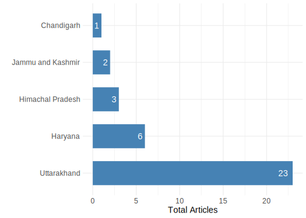
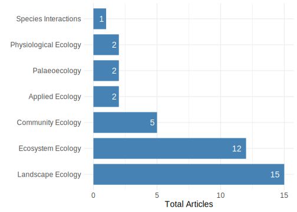
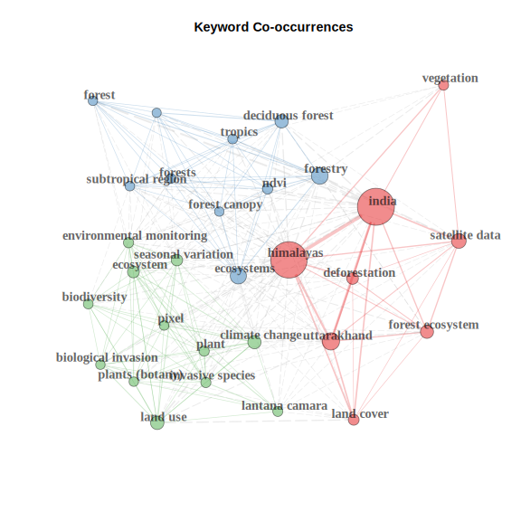

# Plant Ecology in Indian Siwaliks


## Abstract

Conservation science and practice commonly draw on the theories and methods of
social psychology to explain human cognition, emotion, and behaviour germane to
biodiversity conservation. We created a systematic map of the cross-disciplinary
conservation science literature, which draws on social psychology concepts and
methods in their application broadly described as conservation psychology.
Established protocols were used to systematically collect and collate
peer-reviewed research published in an explicit selection of multidisciplinary
conservation journals. We sought to catalogue the literature, elucidate trends
and gaps, and critically reflect on the state of conservation psychology and its
research practices that aim to influence conservation outcomes. The volume of
publications per year and per decade increased from 1974 to 2016. Although a
diversity of research designs and methods was applied, studies
disproportionately focused on specific concepts (attitudes and beliefs),
locations (North America and Europe), and contexts (terrestrial, rural). Studies
also tended to be descriptive, quantitative, and a theoretical in nature. Our
findings demonstrate that although conservation psychology has generally become
more visible and prominent, it has done so within a limited space and suggest
that disciplinary research principles and reporting standards must be more
universally adopted by traditional and multidisciplinary conservation journals
to raise the floor of empirical research.

## Introduction

The rate of anthropogenic biodiversity loss far exceeds the background rate of
species extinctions. Global targets for biodiversity acknowledge this,
nevertheless progress towards targets has been poor. There is now a reasonable
understanding of what human pressures threaten the survival of species. However,
information on where these threats are impacting species is needed to coordinate
conservation actions and threat abatement efforts. Herein, threats are defined
as human-driven pressures specifically where they co-occur with, and threaten
the survival of, native wild species. There is a large number of studies that
map either distributions of threatened species or human-driven pressures alone.
This makes it difficult to identify research that has investigated the spatial
distribution of the threats themselves. Additionally, the high variability in
approaches taken in these studies promotes a high risk of duplication and
diversity among the findings. This variation, and the lack of studies directly
mapping threats, limits the utility of threat mapping studies for conservation
planning and informing policy. Therefore, a systematic consolidation of the
literature is necessary to identify where knowledge is lacking, and where
sufficient evidence exists for synthesis of the collective findings.
Understanding ecological structure and functions is vital for ensuring the
sustainability of any ecosystem. Objective of the review Ecological studies
Concern/Problem Ecology enriches our world and is crucial for human wellbeing
and prosperity. It provides new knowledge of the interdependence between people
and nature that is vital for food production, maintaining clean air and water,
and sustaining biodiversity in a changing climate. There is a need to know the
quantity and quality of research that has been conducted on a specific question.
A descriptive overview is required of the evidence base for a given topic

Systematic mapping provides a snapshot of the current state of knowledge,
identifying areas needing more research attention and those ready for full
synthesis.

## Objectives

This review aims to describe the focus of plant ecological studies by analysing
the current evidence of existing studies. Further, we will identify the clusters
and gaps in the current knowledge, which will guide the future investigations.

-   **Primary question:** What evidence exists for research focusing on plant
    ecology in Indian Siwaliks?

    -   **Population:** The evidence base of studies focusing plant ecology in
        Indian Siwaliks. The taxonomic scope of this review is any plant species
        in the Siwaliks of north-west India. The siwalik region has been defined
        as the foothills of the Himalayas and spatially as defined by the
        Geological Survey of India
        (<https://bhukosh.gsi.gov.in/Bhukosh/MapViewer.aspx>).
    -   **Outcome:** The distribution of studies focusing plant ecology will be
        the outcome to be analysed. The studies to be included must have
        addressed any aspect of plant ecology. By Plant Ecology, we mean studies
        addressing distribution of plants, and interactions of plants with
        environment or other species. Thus, the studies must have plants as one
        of the components under study. However, this study will not focus on
        agroecological aspects, therefore studies focusing on agricultural
        systems will be beyond the scope of this review.

-   **Secondary questions**

    -   What is the geographical distribution of the evidence?
    -   What is the temporal distribution of the evidence?
    -   Which domains of ecology are frequently studied?
    -   What taxonomic groups of plants have been studied?\
    -   What are the knowledge gaps that need to be addressed?

## Methodology

We adopted the guidelines and recommendations established by Collaboration for
Environmental Evidence (CEE) for evidence synthesis in environmental management
[@CEE2018]. These recommendations are designed to improve transparency and
reproducibility of reviews in environmental contexts [@CEE2018; @grames2020]. We
departed from recommended practises as we neither consulted stakeholders nor
registered a protocol. A review team comprising of individuals with relevant
skills and knowledge (subject and methodological) was formed. The roles and
responsibilities of each participant has been defined during the initial project
development. We organised meetings and discussions at every weekend to develop
the protocol, search strategy, screening, data extraction, analyses and writing.
The selection of appropriate studies for the present review involved of three
phases: searching, screening, and inclusion (Figure \@ref(fig:fig21)).

<div class="figure" style="text-align: center">

```{=html}
<div id="htmlwidget-6d3e1150fc263f9b8f54" style="width:750px;height:800px;" class="grViz html-widget"></div>
<script type="application/json" data-for="htmlwidget-6d3e1150fc263f9b8f54">{"x":{"diagram":"digraph G{\n\t\t\t\n\tgraph[ranksep=0.35, newrank=true, nodesep=0.25, splines=ortho]\n\t\t\t\n\tsubgraph cluster_searching{\n\tlabel=\"Searching\"; style=filled; color=mintcream; fontsize=18\n\tnode[label=\"Scopus\n(n = 1,876)\", shape=box, width=1.25, \n\tfillcolor=grey95]searching_A;\n\tnode[label=\"Web of Science\n(n = 1,013)\", shape=box, width=1.25]searching_B;\n\tnode[label=\"Total records\n(n = 2,888)\", shape=box, width=3]searching_C;\n\tsearching_A -> searching_C\n\tsearching_B -> searching_C\n\t{rank=same;searching_A;searching_B}\n\t}\n\t\n\tsubgraph cluster_screening{\n\tlabel=\"\"; style=filled; color=lightyellow; shape=box; fontsize=18\n\tnode[label=\"Records after duplicates removed \n (n = 2,171)\", shape=box, \n\twidth=3]screening_1\n\tnode[label=\"Records after title screening \n (n = 375)\", shape=box, \n\twidth=3]screening_2\n\tnode[label=\"Records after abstract screening \n (n = 111)\",shape=box, \n\twidth=3]screening_3\n\tnode[label=\"Articles retrieved at full text \n (n = 100)\",shape=box, \n\twidth=3]screening_4\n\tnode[label=\"Articles after full text screening \n (n = 40)\",shape=box, \n\twidth=3]screening_5\n\tsearching_C -> screening_1[minlen=2, label=\"    Screening\"]\n\tscreening_1 -> screening_2 -> screening_3 -> screening_4 -> screening_5\n\t}\n\t\n\tnode[label=\"Duplicates \n (n = 717)\", shape=box, width=2, style=filled,\n\tfillcolor=seashell]screening_a\n\tnode[label=\"Excluded titles \n (n = 1,796)\", shape=box, width=2, style=filled,\n\tfillcolor=seashell]screening_b\n\tnode[label=\"Excluded abstracts \n (n = 264)\", shape=box, width=2, style=filled,\n\tfillcolor=seashell]screening_c\n\tnode[label=\"Unretrievable full text \n (n = 11)\", shape=box, width=2, style=filled,\n\tfillcolor=seashell]screening_d\n\tnode[label=\"Excluded articles \n (n = 71)\", shape=box, width=2, style=filled,\n\tfillcolor=seashell]screening_e\n\t\n\tscreening_1 -> screening_a\n\tscreening_2 -> screening_b\n\tscreening_3 -> screening_c\n\tscreening_4 -> screening_d\n\tscreening_5 -> screening_e\n\t\n\t{rank=same;screening_1;screening_a;}\n\t{rank=same;screening_2;screening_b;}\n\t{rank=same;screening_3;screening_c;}\n\t{rank=same;screening_4;screening_d;}\n\t{rank=same;screening_5;screening_e;}\n\t\n\tsubgraph cluster_articles{\n\tlabel=\"\";style=filled;color=grey95;\n\tnode[label=\"Studies included in synthesis \n (n = 40)\", shape=box, width=3, \n\tstyle=filled, fillcolor=grey95]articles_A\n\tscreening_5 -> articles_A[minlen=2, label=\"    Synthesis\"]\n\t}\n\t\n\t}","config":{"engine":"dot","options":null}},"evals":[],"jsHooks":[]}</script>
```

<p class="caption">(\#fig:fig21)Schematic flow diagram for literature search, screening and inclusion process based on [@haddaway2018]</p>
</div>

### Literature database

Scopus (<https://scopus.com/>) and Web of Science
(<https://webofknowledge.com/>) are the most reliable databases for retrieval of
high-quality peer-reviewed scientific literature in the fields of science and
technology. Although the Web of Science Core Collection consists of seven
indices: (i) Science Citation Index Expanded (SCIE), (ii) Social Sciences
Citation Index (SSCI), (iii) Arts & Humanities Citation Index (AHCI), (iv)
Conference Proceedings Citation Index (CPCI), (v) Book Citation Index (BCI),
(vi) Emerging Sources Citation Index (ESCI), and (vii) Current Chemical
Reactions and Index Chemicus
(<https://clarivate.com/webofsciencegroup/solutions/web-of-science-core-collection/>),
our institution provided us access to SCIE, SSCI and AHCI for the timespan
1989-present. Both databases allow to export bibliographic meta-data offer great
accuracy and reproducibility of literature search. However, access to these
databases required a subscription through payment of large money. Although both
databases emerged in 2004, Scopus offers relatively larger coverage of
scientific literature whereas Web of Science provides offers coverage from early
1900.

On the other hand, Google Scholar (<https://scholar.google.com/>) is freely
available and has most comprehensive coverage as it offers retrieval of most
obscure information. Although it also provides access to full text articles, it
is not a bibliographic database. Its content is dynamic and has compromised
accuracy. Further, it lacks several functionalities in literature search like
subject filtering and tagging. Considering these limitations, we limited our
literature search to two bibliographic databases of peer-reviewed literature
([Web of Science Core Collection](https://webofknowledge.com/) and
[Scopus](https://scopus.com/)).

### Search strings

We identified the terms that are frequently applied to the region using a
preliminary literature search and discussion with review team members 
(Table \@ref(tab:kw21)). 

<table>
<caption>(\#tab:kw21)List of keywords used for developing search string</caption>
 <thead>
  <tr>
   <th style="text-align:left;color: #fff !important;background-color: #666 !important;"> group1 </th>
   <th style="text-align:left;color: #fff !important;background-color: #666 !important;"> group2 </th>
   <th style="text-align:left;color: #fff !important;background-color: #666 !important;"> group3 </th>
   <th style="text-align:left;color: #fff !important;background-color: #666 !important;"> group4 </th>
  </tr>
 </thead>
<tbody>
  <tr>
   <td style="text-align:left;"> shivalik </td>
   <td style="text-align:left;"> himalayan foothills </td>
   <td style="text-align:left;"> jammu hills </td>
   <td style="text-align:left;"> dudhwa range </td>
  </tr>
  <tr>
   <td style="text-align:left;"> sivalik </td>
   <td style="text-align:left;"> outer himalayas </td>
   <td style="text-align:left;"> kangra hills </td>
   <td style="text-align:left;"> dundwa range </td>
  </tr>
  <tr>
   <td style="text-align:left;"> shiwalik </td>
   <td style="text-align:left;"> sub himalayas </td>
   <td style="text-align:left;"> morni hills </td>
   <td style="text-align:left;">  </td>
  </tr>
  <tr>
   <td style="text-align:left;"> siwalik </td>
   <td style="text-align:left;">  </td>
   <td style="text-align:left;"> mohand hills </td>
   <td style="text-align:left;">  </td>
  </tr>
</tbody>
</table>

Using a combination of these terms with boolean operators, 
we developed the following common search string for 
[Web of Science](https://webofknowledge.com/) and [Scopus](https://scopus.com/).

> (shivalik OR sivalik OR shiwalik OR siwalik) OR (himalaya\* AND (foothill\* OR
> outer OR sub)) OR (hill\* AND (jammu OR kangra OR morni OR mohand)) OR
> (range\* AND (dudhwa OR dundwa))

### Literature search

[Scopus](https://scopus.com/): We have queried the above defined search
    string to the "Article title, Abstract, Keywords" in "Documents" using the
    default options for "Limit" (Date range (inclusive): Published from "All
    years" to "Present"; Document type: "ALL"). This query returned a total of
    4,102 document results on 03 April 2021. Then, we have filtered the results
    by limiting subject to "Agricultural and Biological Sciences" and
    "Environmental Science" subject areas, which yielded a total of 1,875
    documents. All these documents were selected by choosing "Select All" option
    and then exported all information by selecting "Citation information",
    "Bibliographical information", "Abstract & keywords", "Funding details" and
    "Other information" in the BibTex format.

[Web of Science Core Collection](https://webofknowledge.com/): The same
    keyword combination was queried in the "Topic" field of Web of Science by
    selecting the database "Web of Science Core Collection". Default settings
    (Web of Science Core Collection: Citation Indexes - Science Citation Index
    Expanded (SCI-EXPANDED) --1989-present, Social Sciences Citation Index
    (SSCI) --1989-present, and Arts & Humanities Citation Index (A&HCI)
    --1989-present; Auto-suggest publication names: On; and Default Number of
    Search Fields to Display: 1 field (Topic)) were used under the more settings
    option. This yielded us 2,978 results on 03 April 2021. Then the results
    were refined by selecting following Web of Science categories: ENVIRONMENTAL
    SCIENCES, PLANT SCIENCES, PALEONTOLOGY, ECOLOGY, BIOLOGY, REMOTE SENSING,
    SOIL SCIENCE, BIODIVERSITY CONSERVATION, FORESTRY, EVOLUTIONARY BIOLOGY, and
    ENVIRONMENTAL STUDIES. This yielded a total of 1,013 results. Then the
    "Show" option was changed from "10 per page" (Default) to "50 per page".
    Next, all entries on a page were first selected using the "Select Page"
    option and then added to "Marked List" using the "Add to Marked List"
    button. This was repeated for all the 21 pages and thus all the 1,103
    entries were added to the "Marked List". Since Web of Science allows export
    of 500 records at time, we have first selected the first 500 records by
    defining the record range "Records: 1 to 500" under the "Step 1: Select
    records." option. Then we have selected all the fields using the "Select
    All" option under "Step 2: Select content. Select from the fields below:"
    option. Next, we have exported the records in BibTex format using the
    "Export" option under the "Step 3: Select destination." And then choosing
    the "BibTex" option under the "Other File Formats". The same process was
    repeated for records 501 to 1,000 and 1,001 to 1,013.

### Article screening

We used the package *revtools* [@revtools2019] in R programming environment [@R-base]
for article screening phase. This phase included de-duplication, title screening,
abstract screening and full text screening. For article screening phase, we adhered 
to the previously proposed eligibility criteria (Table \@ref(tab:ec22)).

<table>
<caption>(\#tab:ec22)Eligibility criteria for inclusion or exclusion of studies</caption>
 <thead>
  <tr>
   <th style="text-align:left;color: #fff !important;background-color: #666 !important;"> Criteria </th>
  </tr>
 </thead>
<tbody>
  <tr grouplength="6"><td colspan="1" style="border-bottom: 1px solid;"><strong>Inclusion</strong></td></tr>
<tr>
   <td style="text-align:left;padding-left: 2em;" indentlevel="1"> articles falling in general scope of plant ecology </td>
  </tr>
  <tr>
   <td style="text-align:left;padding-left: 2em;" indentlevel="1"> study sites or their part situated within the 
			  boundary of Siwaliks </td>
  </tr>
  <tr>
   <td style="text-align:left;padding-left: 2em;" indentlevel="1"> studies involving plants as one of the component </td>
  </tr>
  <tr>
   <td style="text-align:left;padding-left: 2em;" indentlevel="1"> studies related to plant distributions and their interactions 
			  with environment </td>
  </tr>
  <tr>
   <td style="text-align:left;padding-left: 2em;" indentlevel="1"> studies involving ecosystem processes such as nutrient cycling,
			 carbon sequestration, and biomass production </td>
  </tr>
  <tr>
   <td style="text-align:left;padding-left: 2em;" indentlevel="1"> studies referring to palaeoecological studies such as fossil 
			  distribution and past vegetation </td>
  </tr>
  <tr grouplength="6"><td colspan="1" style="border-bottom: 1px solid;"><strong>Exclusion</strong></td></tr>
<tr>
   <td style="text-align:left;padding-left: 2em;" indentlevel="1"> studies concerning animals, fungi, microbes or any organism 
			  other than plants </td>
  </tr>
  <tr>
   <td style="text-align:left;padding-left: 2em;" indentlevel="1"> studies focusing agroecosystems and agricultural practices </td>
  </tr>
  <tr>
   <td style="text-align:left;padding-left: 2em;" indentlevel="1"> studies related to ethnobotanical or traditional uses of plants </td>
  </tr>
  <tr>
   <td style="text-align:left;padding-left: 2em;" indentlevel="1"> studies evaluating phytochemicals or biological activities </td>
  </tr>
  <tr>
   <td style="text-align:left;padding-left: 2em;" indentlevel="1"> studies focusing cytology, genetics or molecular biology of plants </td>
  </tr>
  <tr>
   <td style="text-align:left;padding-left: 2em;" indentlevel="1"> studies reporting discovery of new species </td>
  </tr>
</tbody>
</table>


**De-duplication**: Database may have erroneous duplications or due to automated information
extraction systems. Thus, the documents can be largely duplicated within and
across literature databases. These duplicates might waste the energy and time of
the reviewers apart from erroneous results of reviews. Therefore, removal of
duplicates is necessary. Several procedures and software are available for
automated de-duplication of literature. Here, we have first de-duplicated the
documents based on doi (digital object identifier) of each articles. Then, we
have de-duplicated by matching title of each article. However, the upper- or
lower case and punctuations can interfere with title matching. Therefore, we
converted titles to lower case and removed punctuations before matching. Thus,
after de-duplication we are left with 2,171 (unique doi = 2,366, unique doi +
unique title = 2,171) articles out of total 2,888 articles. After this, we have
performed manual screening of duplicates, if remained any.


**Title screening**: After de-duplication of articles, we performed 
article screening based on their titles. We have hidden every other information 
during title screening to avoid any potential bias. We assigned one of three labels 
to each article (i) *selected*, (ii) *excluded*, or (iii) *unknown*. We excluded 
1,796 articles based on title screen and remaining 375 articles were
selected for abstract screening out of which 158 articles were assigned
"selected" and 217 articles were assigned "unknown" during the title screening. 
Next, we removed the articles assigned as "excluded" and screened for abstracts.


**Abstract screening**: Our abstract screening resulted in exclusion of 264 articles and 
we are left with only 111 articles. Then we filtered these 111 articles and saved as the 
included articles. Then we searched for full text for every article from publisher's website,
Google Scholar, Research Gate and institutional repositories. We were not able
to retrieve full text of following 11 articles. We excluded these 11 articles and 
screened full text of articles.  

1.  Devi, B., Bhardwaj, D. R., Panwar, P., Pal, S., Gupta, N. K., & Thakur, C.
    L. (2013). Long term effects of natural and plantation forests on carbon
    sequestration and soil properties in mid-hill sub-humid condition of
    Himachal Pradesh, India. *Range Management and Agroforestry, 34*, 19--25.
2.  Mehta, S., & Singh, Y. (1994). Spatio-temporal changes in the natural hilly
    ecosystem: a case study of the Chandigarh Siwalik Hills. *Transactions -
    Institute of Indian Geographers, 16*, 135--146.
3.  Pandey, R. K., Bindroo, B. B., Dhar, A., & Khan, M. A. (2010). Oak
    regeneration in Sub-Himalayan India. *Indian Silk, 1*, 19--21.
4.  Panwar, P., Pal, S., Bhatt, V. K., & Prasad, R. (2014). Land use and canopy
    positions affect organic carbon pools and fertility of soils in lower
    Himalayan region, India. *Agrochimica, 58*, 51--62.
5.  Pokhriyal, T. C., Chaukiyal, S. P., & Singh, K. C. H. (1996). Nitrogen
    fixation and nodulation behaviour in relation to seasonal changes in six
    multipurpose tree species. *Indian Forester, 122*, 718--726.
6.  Purohit, S., Aggarwal, S. P., & Patel, N. R. (2021). Estimation of forest
    aboveground biomass using combination of Landsat 8 and Sentinel-1A data with
    random forest regression algorithm in Himalayan Foothills. *Tropical
    Ecology, 62*, 288--300. <https://doi.org/10.1007/s42965-021-00140-x>
7.  Rajwar, G. S. (1991). *Advances in Himalayan Ecology*. Today & Tomorrow's
    Printers and Publishers, New Delhi.
8.  Rajwar, G. S. (1993). *Garhwal Himalaya: Ecology and Environment*. Ashish
    Publishing House, New Delhi.
9.  Ram, N., & Jana, M. M. (1997). Ecological impact of compaction under teak
    plantation in the foothill of Darjeeling himalaya. *Indian Forester, 123*,
    623--630.
10. Rout, S., & Gupta, S. (1989). Soil respiration in relation to abiotic
    factors, forest floor litter, root biomass and litter quality in forest
    ecosystems of Siwaliks in Northern India. *Acta Oecologica. Oecologia
    Plantarum, 10*(3), 229--244.
11. Singh, R., Goraya, G. S., Singh, C., Kumar, S., & Kumar, S. (2001).
    Mortality of Chir pine trees by insect borers in Morni Hills, Haryana - A
    case study. *Indian Forester, 127*, 1279--1286.


**Full text screening**: For full text screening, we first selected three variables 
(`label`, `journal` and `year`) from the included abstracts. Then, we manually 
screened articles based on the full text of every article. This process excluded 
71 more articles and we left with only 40 studies.

### Data extraction

Considering the questions initially posed, we looked for the following
information (if available) for each article:

-   plant taxa studied (if available), to estimate taxonomic scope of studies
-   geographic location (latitude and longitude) to estimate geographical
    distribution of studies. If it is not available in study, we estimate the
    approx location using Google Maps and Google Earth. We also recorded the
    Indian state in which study was conducted.
-   year of the study to estimate temporal distribution of studies
-   Domain and subdomain of plant ecology for each the study. Adopting a single
    unique classification system for ecological studies is difficult as study
    areas often overlap. However, we followed the following broad classification
    system for the present study (Table \@ref(tab:clasf23)).

<table>
<caption>(\#tab:clasf23)Classification scheme for included studies</caption>
 <thead>
  <tr>
   <th style="text-align:left;color: #fff !important;background-color: #666 !important;"> Ecology domain </th>
   <th style="text-align:left;color: #fff !important;background-color: #666 !important;"> Included topics </th>
  </tr>
 </thead>
<tbody>
  <tr>
   <td style="text-align:left;"> Organismal ecology </td>
   <td style="text-align:left;"> Population genetics, natural selection, behaviour </td>
  </tr>
  <tr>
   <td style="text-align:left;"> Physiological ecology </td>
   <td style="text-align:left;"> Adaptations to abiotic factors like temperature, light </td>
  </tr>
  <tr>
   <td style="text-align:left;"> Population ecology </td>
   <td style="text-align:left;"> Population growth, demography, age structure </td>
  </tr>
  <tr>
   <td style="text-align:left;"> Species interactions </td>
   <td style="text-align:left;"> Competition, facilitation, parasitism, symbiosis </td>
  </tr>
  <tr>
   <td style="text-align:left;"> Community ecology </td>
   <td style="text-align:left;"> Species diversity, succession, biogeography </td>
  </tr>
  <tr>
   <td style="text-align:left;"> Ecosystem ecology </td>
   <td style="text-align:left;"> Food web, biomass production, nutrient cycling, soil </td>
  </tr>
  <tr>
   <td style="text-align:left;"> Palaeoecology </td>
   <td style="text-align:left;"> Fossil records, palaeo-vegetation </td>
  </tr>
  <tr>
   <td style="text-align:left;"> Landscape ecology </td>
   <td style="text-align:left;"> Land use and land cover, ecological modelling, spatial and global ecology </td>
  </tr>
  <tr>
   <td style="text-align:left;"> Applied ecology </td>
   <td style="text-align:left;"> Conservation, management and restoration ecology </td>
  </tr>
</tbody>
</table>
Next, we manually extracted data from each of the 40 articles and assigned an
ecological domain and subdomain according the above classification system (Table
\@ref(tab:clasf23)).


## Results

### Geographical distribution of the studies




### Temporal distribution of the evidence



### Domains of ecology



### Taxonomic groups of plants

Among the various taxonomic groups of plants Angiosperms

### Top journal sources

<table>
<caption>(\#tab:unnamed-chunk-11)Top journal sources</caption>
 <thead>
  <tr>
   <th style="text-align:left;"> Sources </th>
   <th style="text-align:right;"> Articles </th>
  </tr>
 </thead>
<tbody>
  <tr>
   <td style="text-align:left;"> INTERNATIONAL JOURNAL OF REMOTE SENSING </td>
   <td style="text-align:right;"> 4 </td>
  </tr>
  <tr>
   <td style="text-align:left;"> Forest Ecology and Management </td>
   <td style="text-align:right;"> 3 </td>
  </tr>
  <tr>
   <td style="text-align:left;"> Tropical Ecology </td>
   <td style="text-align:right;"> 3 </td>
  </tr>
  <tr>
   <td style="text-align:left;"> Environmental Monitoring and Assessment </td>
   <td style="text-align:right;"> 2 </td>
  </tr>
  <tr>
   <td style="text-align:left;"> FLORA </td>
   <td style="text-align:right;"> 2 </td>
  </tr>
  <tr>
   <td style="text-align:left;"> Indian Journal of Ecology </td>
   <td style="text-align:right;"> 2 </td>
  </tr>
  <tr>
   <td style="text-align:left;"> JOURNAL OF THE INDIAN SOCIETY OF REMOTE SENSING </td>
   <td style="text-align:right;"> 2 </td>
  </tr>
  <tr>
   <td style="text-align:left;"> Palaeogeography, Palaeoclimatology, Palaeoecology </td>
   <td style="text-align:right;"> 2 </td>
  </tr>
  <tr>
   <td style="text-align:left;"> Proceedings: Plant Sciences </td>
   <td style="text-align:right;"> 2 </td>
  </tr>
</tbody>
</table>

### Knowledge gaps
